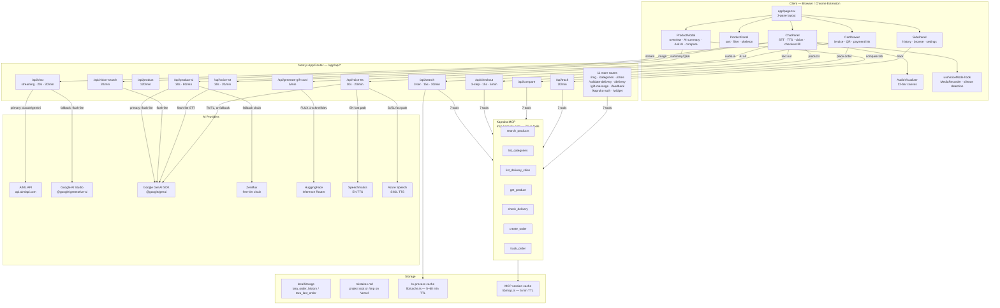
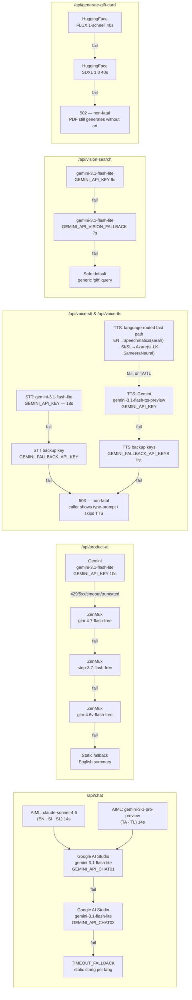
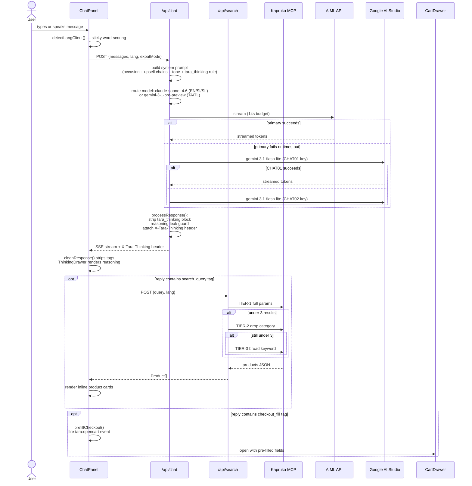

# TARA ✦ The AI Retail Agent

> Multilingual conversational shopping agent built on [Kapruka.lk](https://www.kapruka.com) — Sri Lanka's leading online store.  
> Turns a 7-minute browsing-and-checkout flow into a 2-minute conversation.

**Live demo:** [tara-green.vercel.app](https://tara-green.vercel.app)  
**Stack:** Next.js 16.2.7 · TypeScript strict · Tailwind CSS v4 · Three.js r184 · Vercel 

---

## What is TARA?

TARA replaces the traditional Kapruka website UI with a warm, voice-enabled, AI-powered chat interface. Customers describe what they need — in any of 5 Sri Lankan languages — and TARA handles product discovery, gift suggestions, delivery validation, checkout pre-fill, order tracking, and invoice generation without the user ever touching a form.

---

## Feature Overview

| Feature | Details |
|---|---|
| 🌐 5-language chat | Sinhala · Tamil · Singlish · Tanglish · English — sticky auto-detection |
| 🏆 AI product ranking | Gemini-powered ranking: exact → variant → newer → alternative; accessories excluded |
| ⭐ TARA's Pick | Top 3 ranked products badged with gold border in chat inline cards |
| 🛍️ Natural-language checkout | One message fills all checkout fields and opens the cart |
| 🔒 In-app payment | Kapruka checkout embedded in iframe modal — no redirect to external site |
| 📋 Track order | Track order panel in sidebar (desktop + mobile) with live status lookup |
| 💬 Chat notifications | Cart actions, checkout receipts with product images, and errors shown in chat |
| 🧾 AI receipt in chat | Checkout receipt with inline product images + Download/Share PDF buttons in chat |
| 🎁 Gift chain upselling | 8 product-pair chains, max 2 follow-ups, all 5 languages |
| 📸 Vision search | Upload or paste an image → Gemini identifies the product |
| 🎙️ Voice mode (STT + TTS) | Speak to TARA and hear her reply; hands-free loop available |
| 📦 PDF invoice | Downloadable/shareable order receipt with QR code + AI gift-card art |
| 🧠 Agentic thought UI | Collapsible reasoning drawer on every TARA message |
| 📅 Occasion awareness | 8 seasonal occasions injected into every request |
| 🔍 3-tier search + AI ranking | Keyword + category + price → heuristic filter → Gemini ranking → supplementary out-of-stock fetch |
| 📋 Product comparison | Side-by-side MCP-fetched same-type products in modal |
| 🔄 Product detail fallback | MCP search fallback when get_product fails (CATSYM/delisted) — uses search by name, matches by ID |
| 🗂️ Order history | 20-entry localStorage log with reorder-in-one-tap |
| 👍 / 👎 Feedback loop | Per-reply quality signals → structured `mistakes.md` log |
| 🔌 Chrome extension | Floats TARA inside Kapruka.com on product pages |
| 🪟 Embeddable widget | `/widget` + `/embed-demo` iframe integration |

---

## System Architecture

### High-Level Architecture



### AI Provider Routing



### Chat Request Lifecycle



---

## API Routes

All routes export `dynamic = 'force-dynamic'`. Rate limits are per-IP, per-minute, in-process (reset on Vercel cold start).

| Route | Method | Purpose | Rate limit | Max duration |
|---|---|---|---|---|
| `/api/chat` | POST | Streaming AI chat · lang routing · upsell · checkout_fill tag | 30/min | 20 s (code) / 30 s (vercel.json) |
| `/api/search` | POST | 3-tier product search + AI ranking (Gemini) + supplementary out-of-stock fetch | 30/min | 15 s |
| `/api/product` | POST | Single product detail + image gallery via MCP + search fallback by name | 120/min | default |
| `/api/product-ai` | POST | AI product summary + conversational Q&A | 80/min | 30 s |
| `/api/vision-search` | POST | Gemini vision → product search query | 20/min | default |
| `/api/voice-stt` | POST | Speech-to-text (audio/webm → transcript) | 20/min | 30 s |
| `/api/voice-tts` | POST | Text-to-speech → audio/wav (Speechmatics/Azure/Gemini, language-routed) | 20/min | 30 s |
| `/api/generate-gift-card` | POST | AI illustration for invoice header (FLUX) | 5/min | default |
| `/api/checkout` | POST | 3-step: city canonicalise → delivery check → create order | 5/min | 15 s |
| `/api/validate-delivery` | POST | Fuzzy city match + delivery date pre-check | 60/min | default |
| `/api/compare` | POST | MCP-fetched same-type products for Compare tab | default | default |
| `/api/track` | POST | Order status via `kapruka_track_order` | 20/min | default |
| `/api/gift-message` | POST | AI gift message (ASCII-safe for Kapruka's Latin-1 field) | 10/min | default |
| `/api/feedback` | POST | 👎 report → structured entry in `mistakes.md` | default | default |
| `/api/img` | GET | Image proxy (Kapruka CDN requires Referer/Origin headers) | 200/min | default |
| `/api/categories` | GET | Live category tree (60-min in-process cache) | 30/min | default |
| `/api/cities` | GET | `kapruka_list_delivery_cities` | 120/min | default |
| `/api/delivery` | POST | Legacy delivery check (imports `lib/mcp.ts`) | 60/min | default |
| `/api/kapruka-auth` | POST | Kapruka customer login proxy (Magento loginPost) | 10/min | default |

---

## Kapruka MCP Integration

**Endpoint:** `https://mcp.kapruka.com/mcp` (overridable via `MCP_URL`)  
**Protocol:** JSON-RPC 2.0 over HTTP, SSE response format  
**Session caching:** `lib/mcp.ts` — module-scoped, 5-minute TTL, auto-retry with fresh session on failure

### 7 Live Tools (verified Jul 5 2026)

| Tool | Used by |
|---|---|
| `kapruka_search_products` | `/api/search`, `/api/compare` |
| `kapruka_list_categories` | `/api/categories` |
| `kapruka_list_delivery_cities` | `/api/cities`, `/api/checkout`, `/api/validate-delivery` |
| `kapruka_get_product` | `/api/product` |
| `kapruka_check_delivery` | `/api/delivery`, `/api/checkout`, `/api/validate-delivery` |
| `kapruka_create_order` | `/api/checkout` |
| `kapruka_track_order` | `/api/track` |

**Critical rules:**
- Always pass `response_format: 'json'` in every MCP call
- Cakes and flowers: always send `category: null` — the MCP category filter returns 0 results for these (confirmed live)
- Compare tab: always `category: null` — display category strings are not valid MCP filter values
- `/api/checkout` and `/api/track` re-implement MCP session logic locally. Update in three places if you change the session protocol: `lib/mcp.ts`, `checkout/route.ts`, `track/route.ts`

### MCP Call Pattern

```typescript
import { mcpSession } from '@/lib/mcp';
const MCP = process.env.MCP_URL ?? 'https://mcp.kapruka.com/mcp';
const H   = { 'Content-Type': 'application/json', 'Accept': 'application/json, text/event-stream' };

const sid = await mcpSession();   // cached 5 min; pass true to force-refresh
const r   = await fetch(MCP, {
  method: 'POST',
  headers: { ...H, 'mcp-session-id': sid },
  body: JSON.stringify({
    jsonrpc: '2.0', id: String(Date.now()), method: 'tools/call',
    params: {
      name: 'kapruka_TOOL_NAME',
      arguments: { params: { ...args, response_format: 'json' } },
    },
  }),
});
const text = await r.text();
const m    = text.match(/^data:\s*(.+)$/m);
const raw  = JSON.parse(m ? m[1] : text)?.result?.content?.[0]?.text ?? '';
```

### 3-Tier Search + AI Ranking

```
TIER-1  →  full params (q + category + price filters)
               if results < 5 → TIER-2
TIER-2  →  drop category, q only + AI heuristic validator
               if results < 5 → TIER-3
TIER-3  →  single broad keyword retry
SUPPLEMENT → when TIER-1 succeeds (≥5), also fetch with in_stock_only:false
             to catch out-of-stock variants (e.g. all iPhone 16 models)
AI RANK  →  Gemini ranks top 20 heuristic-filtered products:
             exact → variant → newer → alternative
             accessories excluded via excluded_ids
             fallback: heuristic order on AI failure/timeout (8s)
```

Upstream rate-limit / error strings from MCP trigger a one-shot retry with a fresh session + 400 ms backoff before falling through to the next tier. When AI ranking succeeds, its ordering replaces category diversification (diversification remains as fallback only).

---

## In-Process Cache

`lib/cache.ts` — module-scoped Map; resets on Vercel cold start but highly effective within a warm function pool.

| Data type | TTL |
|---|---|
| Search results | 5 min |
| Product details | 30 min |
| Delivery check | 10 min |
| Delivery cities | 60 min |
| Category tree | 60 min |

---

## Language Support & Model Routing

Language is detected **client-side** in `ChatPanel.tsx` (`detectLangClient`) using Unicode-range tests and ~135-token word scoring (55 Singlish + ~80 Tanglish keywords). Detection is **sticky** — short messages, order numbers, and product names do not reset the language. The resolved `lang` is sent in every `/api/chat` request; the server's `detectLang()` is a non-sticky fallback only.

| Language | Detection | Primary model via AIML |
|---|---|---|
| English | Default fallback | `anthropic/claude-sonnet-4.6` |
| Sinhala (සිංහල) | Unicode U+0D80–U+0DFF | `anthropic/claude-sonnet-4.6` |
| Singlish | Word scoring ~55 tokens | `anthropic/claude-sonnet-4.6` |
| Tamil (தமிழ்) | Unicode U+0B80–U+0BFF | `google/gemini-3-1-pro-preview` |
| Tanglish | Word scoring ~80 tokens | `google/gemini-3-1-pro-preview` |

Chat fallback when AIML fails: `gemini-3.1-flash-lite` via Google AI Studio with extended thinking (`thinkingLevel: MEDIUM`). Keys tried: `GEMINI_API_CHAT01` → `GEMINI_API_CHAT02`.

Product AI uses a system-prompt language-matching rule — it does not share the chat route's model or detection.

---

## Voice Mode

Implemented in `lib/useVoiceMode.ts`, rendered in `ChatPanel.tsx` with `AudioVisualizer.tsx`.

### Constants

| Constant | Value | Purpose |
|---|---|---|
| `MIN_SPEECH_MS` | 350 ms | Minimum sustained speech before arming silence detection |
| `SILENCE_MS` | 1 500 ms | Pause that counts as done talking |
| `MAX_RECORD_MS` | 60 s | Hard recording cap |
| `STT_TIMEOUT_MS` | 20 s | Abort if STT request takes longer |
| Max audio size | 8 MB | ~60 s of webm/opus |
| Max TTS input | 600 chars | Text truncated before sending |

### Flow

```
Mic button tapped (user gesture)
  → primeAudioElement() — plays silent WAV to unlock iOS Safari audio
  → mic stream + AudioContext are reused if still live from an earlier recording
    this session (only re-acquired via getUserMedia the first time), keeping
    repeat taps fast
  → MediaRecorder starts, AnalyserNode monitors RMS for silence detection
  → tap mic again to cancel, or tap the send button to finish & submit
    (hands-free mode also auto-stops on detected silence)
  → POST audio/webm to /api/voice-stt → transcript
  → sendMessage(transcript) → ChatPanel streaming reply
  → speak(replyText) splits the reply into sentences and requests TTS for all
    of them in parallel, then plays them back in order — audio starts as soon
    as the first sentence is ready rather than waiting on the full reply
  → [if hands-free mode on] → 500 ms delay → restart recording
```

**Speaker toggle (🔊/🔇 in app header):** disables TTS only — STT and hands-free loop keep running.

**Manual vs. hands-free mic button:** tapping the mic mid-recording always cancels (discards) the recording in both modes; a dedicated send button appears next to it whenever recording is active, in both manual and hands-free mode, to actually submit.

### Text-to-Speech Provider Routing

TTS is language-routed to a fast provider first, falling back to Gemini if that fails:

| Language | Primary provider | Voice |
|---|---|---|
| English | Speechmatics | `sarah` |
| Sinhala / Singlish | Azure Speech | `si-LK-SameeraNeural` |
| Tamil / Tanglish | Gemini directly | `Kore` (no fast provider covers Tamil TTS yet) |

If the primary provider fails for any language, the request falls back to the original Gemini path: `gemini-3.1-flash-tts-preview` (voice `Kore`), trying `GEMINI_API_KEY` then each key in `GEMINI_FALLBACK_API_KEYS` in order.

> Requires `SPEECHMATICS_API_KEY`, `AZURE_SPEECH_KEY`, and `AZURE_SPEECH_REGION` to be set — see [Environment Variables](#environment-variables). Without them, English/Sinhala/Singlish requests fall straight through to the Gemini path.

---

## Natural Language Checkout

```
User: "Send birthday cake to Priya, 23 Galle Road Colombo 7, 0771234567,
       deliver tomorrow, House, shanu@gmail.com"

LLM emits:
<checkout_fill>{
  "recipient_name":      "Priya",
  "city":                "Colombo 07",
  "address":             "23 Galle Road",
  "recipient_phone":     "0771234567",
  "delivery_date":       "2026-07-07",
  "location_type":       "HOUSE OR RESIDENCE",
  "sender_email":        "shanu@gmail.com",
  "special_instructions": ""
}</checkout_fill>

ChatPanel calls prefillCheckout() → clears all CartContext fields, sets new values
Colombo zone normalisation: "Colombo 7" → "Colombo 07"
tara:opencart event → CartDrawer opens
```

Special instructions (≤250 chars) flow end-to-end: `<checkout_fill>` → `CartContext` → `/api/checkout` → `delivery.instructions` on the MCP order → PDF invoice.

**Transliteration rule:** All name/address fields in `<checkout_fill>` must be in English/romanized letters only. Tamil/Sinhala Unicode is transliterated to English by the AI (e.g. "பிரியா" → "Priya") because Kapruka's order system rejects non-ASCII characters. The checkout route also falls back to "Guest" if the name is empty after ASCII cleaning.

**Date ambiguity** is resolved silently: DD/MM/YYYY (Sri Lanka default) → if past, try MM/DD/YYYY → if still past, use tomorrow.

### In-App Payment

After checkout, the user can pay without leaving TARA:

```
Order confirmed → "Pay Now" button (in cart drawer or chat receipt)
  → tara:open-payment event → CartDrawer opens iframe modal
  → Kapruka checkout page embedded in 90vw × 75vh modal
  → sandbox: allow-forms allow-scripts allow-same-origin allow-popups
  → fallback: "Open in new tab" link if Kapruka blocks iframe embedding
```

CSP `frame-src` allows `https://www.kapruka.com` and `https://kapruka.com` for the payment iframe. The payment panel can also be triggered from the chat receipt's "Pay Now" button via a custom event.

### Chat Notifications

Cart actions and checkout events are mirrored into the chat as assistant messages:

| Event | Source | Chat message |
|---|---|---|
| Add to cart | `CartContext.addItem` | `🛒 Added {product} to cart` |
| Remove from cart | `CartContext.removeItem` | `🗑️ Removed {product} from cart` |
| Update quantity | `CartContext.updateQty` | `📦 Updated {product} quantity to {n}` |
| Checkout success | `CartDrawer.handleCheckout` | Full receipt with product images, details, totals |
| Checkout error | `CartDrawer.handleCheckout` | `⚠️ Checkout issue: {error}` |

The checkout receipt in chat includes inline product images (44×44 thumbnails via `/api/img` proxy), all checkout details (recipient, phone, address, city, delivery date, occasion, gift message), delivery fee, total, and "Download AI Receipt" / "Share Receipt" PDF buttons — same PDF pipeline as CartDrawer (html2canvas + jsPDF + InvoiceTemplate + gift card art + QR code).

---

## Gift Chain Upselling

8 product-pair chains, max 2 follow-ups per conversation thread. Never triggered on groceries, medicine, or checkout.

| Starter | Follow-up 1 | Follow-up 2 |
|---|---|---|
| Roses / Flowers | Chocolates | Greeting Card / Soft Toy |
| Birthday Cake | Flowers | Chocolates |
| Chocolates | Soft Toy | Greeting Card |
| Soft Toy | Chocolates | Greeting Card |
| Giftset / Hamper | Greeting Card | Balloon / Wrap |
| Perfume | Chocolates | Gift Box |
| Phone | Phone Case | Screen Guard |
| Laptop | Laptop Bag | Wireless Mouse |

Affirmatives in all 5 languages (`yes / ok / awa / ஆமா / aama / ඔව්`) advance the chain. Negatives (`no / nehe / illa / vendaam`) end it gracefully.

---

## PDF Invoice Generation

Triggered after a successful order in `CartDrawer.tsx`:

```
Order confirmed
  → snapshot all checkout fields into invoiceSnap (before clearCart())
  → QR code generated client-side via qrcode package
  → user taps Download or Share
      1. POST /api/generate-gift-card → themed FLUX.1 illustration (non-fatal if fails)
      2. setPendingPdf() → hidden <InvoiceTemplate> renders at left:-9999px
      3. 120 ms paint delay → html2canvas screenshots the hidden div
      4. jsPDF wraps screenshot → transparent CTA link overlay on bottom ~28%
      5a. Download: pdf.save(`kapruka-order-{id}.pdf`)
      5b. Share: navigator.share({files:[pdf]}) → fallback to pdf.save()
```

`InvoiceTemplate.tsx` is purely presentational. It receives `InvoiceData` and renders: branded header, QR code, AI gift-card art, line items with quantities/prices, delivery details, special instructions, totals. Never rendered visibly.

---

## Agentic Thought Process UI

Every TARA response begins with a `<tara_thinking>` block (stripped server-side, forwarded as `X-Tara-Thinking` header):

```json
{ "intent": "≤8 words", "goal": "≤8 words", "constraints": ["…"], "plan": ["Step 1", "Step 2"] }
```

ChatPanel reads the header → stores `ThinkingData` on the message → renders a collapsible `ThinkingDrawer`. Upsell/cross-sell steps are filtered from the plan before display. The "🧠 Show TARA's Reasoning" pill only appears on completed non-streaming messages.

---

## Design System — Lumina Palette

```css
--c-background:               #151024   /* deepest base */
--c-surface-container:        #221c31   /* TARA bubble bg */
--c-surface-container-high:   #2c273c   /* product card bg */
--c-primary:                  #d7baff   /* lavender — accents, active pills */
--c-primary-container:        #bd93f9   /* medium purple — user bubbles, buttons */
--c-on-primary-container:     #4e2484   /* dark purple text on primary-container */
--c-secondary:                #c5cd65   /* yellow-green — prices, TARA avatar */
--c-on-secondary:             #2f3300   /* dark text on secondary */
--c-on-surface:               #e8defb   /* body text */
--c-on-surface-variant:       #ccc3d3   /* muted text */
--c-outline:                  #968e9c   /* borders, placeholders */
```

`CartDrawer.tsx` and `InvoiceTemplate.tsx` use a parallel `--t-*` token block (backward-compat aliases, same palette). Everything else uses `--c-*`. Both sets are live — do not delete either without checking both naming conventions.

**Fonts:** Manrope 600/700 (headings) · Hanken Grotesk 400–700 (body)  
**Icons:** always import from `components/Icons.tsx` (inline SVG). The Material Symbols font link in `layout.tsx` is dead weight — unused.  
**Skeleton:** `.skeleton` CSS class in `globals.css` (linear-gradient sweep, 1.6 s loop). Wrap parent in `position:relative` + `overflow:hidden`.

---

## Environment Variables

| Variable | Required | Route(s) | Purpose |
|---|---|---|---|
| `AIML_API_KEY` | ✅ | `/api/chat`, `/api/gift-message` | AIML API — claude-sonnet-4.6 + gemini-3-1-pro-preview |
| `GEMINI_API_KEY` | ✅ | `/api/vision-search`, `/api/product-ai`, `/api/voice-stt`, `/api/voice-tts` | Google GenAI primary key |
| `GEMINI_API_CHAT01` | Recommended | `/api/chat` | Chat fallback — Google AI Studio primary key |
| `GEMINI_API_CHAT02` | Optional | `/api/chat` | Chat fallback — Google AI Studio backup key |
| `GEMINI_API_VISION_FALLBACK` | Optional | `/api/vision-search` | Vision backup key (safe-default returned if missing) |
| `GEMINI_FALLBACK_API_KEY` | Optional | `/api/voice-stt` | STT backup key |
| `GEMINI_FALLBACK_API_KEYS` | Optional | `/api/voice-tts` | TTS fallback keys, only used if the fast provider path fails (comma-separated list) |
| `SPEECHMATICS_API_KEY` | Recommended | `/api/voice-tts` | English TTS fast path (voice: `sarah`) |
| `AZURE_SPEECH_KEY` | Recommended | `/api/voice-tts` | Sinhala/Singlish TTS fast path (voice: `si-LK-SameeraNeural`) |
| `AZURE_SPEECH_REGION` | Recommended | `/api/voice-tts` | Azure region, required alongside `AZURE_SPEECH_KEY` |
| `GEMINI_MODEL` | Optional | `/api/product-ai` | Override Gemini model (default: `gemini-3.1-flash-lite`) |
| `ZENMUX_API_KEY` | Optional | `/api/product-ai` | ZenMux free-tier fallback chain |
| `ZENMUX_PRODUCT_AI_MODEL` | Optional | `/api/product-ai` | Override first ZenMux model |
| `ZENMUX_FALLBACK_MODEL` | Optional | `/api/product-ai` | Appended to end of ZenMux chain |
| `HUGGING_FACE_API_KEY` | ✅ | `/api/generate-gift-card` | HuggingFace FLUX image generation |
| `MCP_URL` | Optional | all MCP routes | Default: `https://mcp.kapruka.com/mcp` |

**Key routing at a glance:**

```
Chat AIML primary      → AIML_API_KEY
Chat Google fallback   → GEMINI_API_CHAT01 → GEMINI_API_CHAT02
Vision search          → GEMINI_API_KEY    → GEMINI_API_VISION_FALLBACK
Product AI (Gemini)    → GEMINI_API_KEY    (model: GEMINI_MODEL)
Voice STT              → GEMINI_API_KEY    → GEMINI_FALLBACK_API_KEY
Voice TTS              → Speechmatics (EN) / Azure (SI, SL) / Gemini (TA, TL)
                          → fallback: GEMINI_API_KEY → each in GEMINI_FALLBACK_API_KEYS
```

> ⚠️ `GEMINI_API_CHAT01`/`CHAT02` are **not** the same as `GEMINI_API_KEY` or `GEMINI_FALLBACK_API_KEY`. These are four distinct slots serving different routes.

---

## Running Locally

```bash
git clone https://github.com/shanujans/tara
cd tara
npm install
```

Minimum `.env.local`:

```env
AIML_API_KEY=your_aiml_key
GEMINI_API_KEY=your_gemini_key
GEMINI_API_CHAT01=your_gemini_key   # can reuse GEMINI_API_KEY for local dev
HUGGING_FACE_API_KEY=your_hf_key
# MCP_URL defaults to https://mcp.kapruka.com/mcp

# Optional — fast TTS providers (recommended; falls back to Gemini if unset)
SPEECHMATICS_API_KEY=your_speechmatics_key
AZURE_SPEECH_KEY=your_azure_speech_key
AZURE_SPEECH_REGION=your_azure_region
```

```bash
npm run dev          # http://localhost:3000
npx tsc --noEmit     # typecheck before pushing
npm run build        # production build check
```

> ⚠️ This project uses Next.js 16.2.7, which has breaking changes vs earlier versions. Check `node_modules/next/dist/docs/` before writing new API-route or middleware code (see `AGENTS.md`).

---

## Chrome Extension

Located in `chrome-extension/`. Manifest V3.

**To install (developer mode):**
1. `chrome://extensions` → Enable Developer mode
2. Load unpacked → select `chrome-extension/`

**URL detection** (fixed in commit `17701bd`): Matches `/buyonline/{slug}/kid/{id}` — the real Kapruka URL scheme. Product ID extracted from `/kid/([a-z0-9_]+)`. Price capture handles multi-currency (LKR, Rs., US$, A$, £).

**Permissions:** `activeTab`, `scripting`, `storage`  
**Content script matches:** `*://*.kapruka.com/*`

A packaged `chrome-extension.zip` is in `public/` for distribution.

---

## Embed / Widget

| Route | Purpose |
|---|---|
| `/widget` | Embeddable iframe — no `X-Frame-Options`, `frame-ancestors: *` |
| `/embed-demo` | Demo page — detects Chrome extension, shows widget in iframe |
| `public/embed.js` | Scriptable embed for third-party integration |

CORS on all `/api/*` routes is open (`Access-Control-Allow-Origin: *`) so the Chrome extension on `kapruka.com` can call TARA's API directly.

---

## Order History & Reorder

| localStorage key | Contents | Used by |
|---|---|---|
| `tara_order_history` | Array of up to 20 orders (newest first) | SidePanel History |
| `tara_last_order` | Most recent order | ChatPanel reorder card |

Order ID: real Kapruka ID when returned, else `ORDERMCP${Date.now().toString().slice(-6)}`.

---

## Feedback & Quality Loop

Every completed TARA message shows a 👍 / 👎 pill (always visible, frosted-glass style).

- **👍** — toggles locally, no network call
- **👎** — opens modal with 7 category pills + free-text field → `POST /api/feedback`

The route appends a structured Markdown entry to `mistakes.md` (project root in dev, `/tmp/mistakes.md` on Vercel — ephemeral but writable):

```markdown
## Issue #42 — 5 Jul 2026, 14:22

**Category:** Wrong products
**Language:** EN

**User reported:**
> searched for roses but got chocolates

**TARA response that triggered this:**
> Here are some chocolates …

**Conversation context (last 4 messages):**
  > **User:** I want roses
  > **TARA:** Here are some chocolates …
```

---

## Debug Logging

All routes use a `LOG` object with `.info` / `.warn` / `.error`. Grep these prefixes in Vercel logs:

| Prefix | Route |
|---|---|
| `[TARA:CHAT]` | `/api/chat` |
| `[TARA:SEARCH]` | `/api/search` (includes `🏆 AI RANK` log) |
| `[TARA:COMPARE]` | `/api/compare` |
| `[TARA:VISION]` | `/api/vision-search` |
| `[TARA:PRODUCT-AI]` | `/api/product-ai` |
| `[TARA:GIFT-CARD]` | `/api/generate-gift-card` |
| `[TARA:VOICE-STT]` | `/api/voice-stt` |
| `[TARA:VOICE-TTS]` | `/api/voice-tts` |
| `[checkout]` | `/api/checkout` |
| `[feedback]` | `/api/feedback` |

---

## Repository Layout

```
tara/
├── app/
│   ├── layout.tsx                  # Fonts (Manrope + Hanken Grotesk)
│   ├── globals.css                 # Lumina tokens (--c-* + --t-* compat) + animations
│   ├── page.tsx                    # 3-pane layout: splash → login → app
│   ├── widget/page.tsx             # Embeddable iframe widget
│   ├── embed-demo/page.tsx         # Extension + widget demo
│   └── api/
│       ├── chat/route.ts           # Streaming AI chat (1 024 lines)
│       ├── search/route.ts         # 3-tier product search (750 lines)
│       ├── product/route.ts        # Single product detail
│       ├── product-ai/route.ts     # AI summary + Q&A (Gemini → ZenMux)
│       ├── vision-search/route.ts  # Image → search query
│       ├── voice-stt/route.ts      # Speech-to-text
│       ├── voice-tts/route.ts      # Text-to-speech → WAV
│       ├── generate-gift-card/     # FLUX.1 AI illustration
│       ├── checkout/route.ts       # 3-step order creation
│       ├── validate-delivery/      # Delivery pre-check
│       ├── compare/route.ts        # Product comparison
│       ├── track/route.ts          # Order tracking
│       ├── gift-message/route.ts   # AI gift message
│       ├── feedback/route.ts       # 👎 report → mistakes.md
│       ├── img/route.ts            # Image proxy
│       ├── categories/route.ts     # Category tree (60-min cache)
│       ├── cities/route.ts         # Delivery cities
│       ├── delivery/route.ts       # Legacy delivery check
│       └── kapruka-auth/route.ts   # Kapruka login proxy
├── components/
│   ├── ChatPanel.tsx               # Main chat UI + voice + vision (live)
│   ├── ProductPanel.tsx            # Product grid + sort/filter (live)
│   ├── ProductModal.tsx            # 4-tab modal (live)
│   ├── ProductCard.tsx             # Card with skeleton shimmer (live)
│   ├── CartDrawer.tsx              # Checkout + invoice PDF (live)
│   ├── InvoiceTemplate.tsx         # Hidden invoice renderer (live)
│   ├── SidePanel.tsx               # History / Browse / Settings (live)
│   ├── LoginModal.tsx              # Guest + account auth (live)
│   ├── SplashScreen.tsx            # Three.js animated sprite (live)
│   ├── AudioVisualizer.tsx         # 12-bar canvas visualizer (live)
│   ├── SidebarShader.tsx           # WebGL sidebar (live, motion/react)
│   ├── TaraBackground.tsx          # WebGL aurora (live, @paper-design/shaders-react)
│   ├── ExpatBanner.tsx             # Expat mode banner (live)
│   ├── Icons.tsx                   # All SVG icons — single source of truth (incl. PackageSearchIcon)
│   ├── DeliveryStatusBadge.tsx     # ⚠️ NOT WIRED — scaffolded, unused
│   ├── BroccoliCharacter.tsx       # ⚠️ NOT WIRED — 3D mascot, unused
│   ├── WelcomeScreen.tsx           # ⚠️ NOT WIRED — standalone welcome, unused
│   ├── Toast.tsx                   # ⚠️ NOT WIRED — generic toast, unused
│   └── LoadingSkeleton.tsx         # ⚠️ NOT WIRED — standalone skeleton, unused
├── context/
│   ├── CartContext.tsx             # Product · CartItem · CartProvider · useCart
│   └── DeliveryContext.tsx         # ⚠️ NOT WIRED — planned feature, unused
├── lib/
│   ├── mcp.ts                      # MCP session cache + typed tool helpers
│   ├── useVoiceMode.ts             # STT + TTS + hands-free loop hook
│   ├── cache.ts                    # In-process cache (cacheGet / cacheSet / TTL)
│   ├── security.ts                 # rateLimit · sanitizeInput · validateCheckout
│   ├── strings.ts                  # UI strings in 5 languages
│   ├── expat.ts                    # detectExpat / detectExpatCountry
│   └── districts.ts                # SL_DISTRICTS array (not yet wired to a select)
├── chrome-extension/               # Manifest V3 extension
│   ├── manifest.json
│   ├── content.js                  # Injects widget on kapruka.com product pages
│   ├── embed.js                    # Widget embed logic
│   ├── detect.js                   # Extension detection for embed-demo
│   └── widget.css
├── public/
│   ├── cartoon.jpg                 # Three.js splash sprite
│   ├── kapruka-logo.png
│   ├── embed.js                    # Scriptable embed for third parties
│   └── chrome-extension.zip        # Packaged extension
├── next.config.ts                  # CSP · CORS · frame-ancestors rules
├── vercel.json                     # maxDuration overrides (chat 30s, search 15s, checkout 15s)
├── AGENTS.md                       # Next.js version warning for AI coding agents
└── mistakes.md                     # 👎 feedback log
```

---

## Dependencies

| Package | Version | Purpose |
|---|---|---|
| `next` | 16.2.7 | App Router framework |
| `react` / `react-dom` | 19.2.7 | UI |
| `typescript` | 5.x | Strict mode |
| `tailwindcss` | 4.x | Utility CSS |
| `three` | 0.184.0 | Splash screen animated sprite |
| `openai` | 6.42.0 | AIML API client (OpenAI-compatible base URL) |
| `@google/generative-ai` | 0.24.1 | Chat fallback (Google AI Studio) |
| `@google/genai` | 2.10.0 | Vision · Voice STT · Voice TTS |
| `@paper-design/shaders-react` | 0.0.76 | WebGL aurora background |
| `motion` | 12.42.1 | Sidebar shader animation (framer-motion successor) |
| `framer-motion` | 12.42.0 | Peer dependency for motion |
| `html2canvas` | 1.4.1 | Invoice PDF screenshot |
| `jspdf` | 4.2.1 | Invoice PDF generation |
| `qrcode` + `@types/qrcode` | 1.5.4 / 1.5.6 | QR code for invoice |

---

## Security Notes

- **Input sanitisation:** `sanitizeInput()` strips `<script>` tags, prompt-injection phrases (`ignore previous instructions`, `system prompt`, `you are now`), and code fences. Hard-truncated at 2 000 chars.
- **Checkout validation:** `validateCheckout()` enforces Sri Lankan phone format (`+94xxxxxxxxx` / `0xxxxxxxxx`), future-only delivery dates, and item count limits (≤30).
- **Product data:** `sanitizeProduct()` normalises untrusted MCP fields, rejects image URLs as product page links, strips HTML from all strings.
- **CORS:** open on all `/api/*` routes by design — the Chrome extension on `kapruka.com` needs it. Tighten in `next.config.ts` for a private deployment.
- **Framing:** `/widget` deliberately omits `X-Frame-Options` (embeddable from any origin). All other routes include `frame-ancestors: none`. Payment iframe explicitly allows `kapruka.com` via CSP `frame-src`.

---

## Performance Optimizations

- **CartContext memoized:** Context value wrapped in `useMemo` with `cartIds: Set<string>` for O(1) cart lookups — typing in cart fields no longer re-renders product cards or chat
- **React.memo on ProductCard + InlineChatCard:** Product cards don't re-render during streaming or unrelated state changes
- **Streaming optimized:** `sendMessage`/`runVisionSearch` use `messagesRef` instead of `messages` in deps — no callback recreation per streaming chunk
- **SidebarShader memoized:** 18 paths (reduced from 36) with module-level durations — animations keep running but component only renders once
- **TaraBackground reduced:** `maxPixelCount` 400×400 (from 800×800), `minPixelRatio` 0.5, `speed` 0.25 — 4x less GPU fill rate, same visual effect
- **ProductPanel callback stabilized:** `onViewDetail` wrapped in `useCallback` to preserve ProductCard memo
- **CartDrawer delivery effect:** `items` removed from deps — quantity changes no longer trigger delivery API re-checks

---

*Built for the Kapruka AI Agent Challenge*
